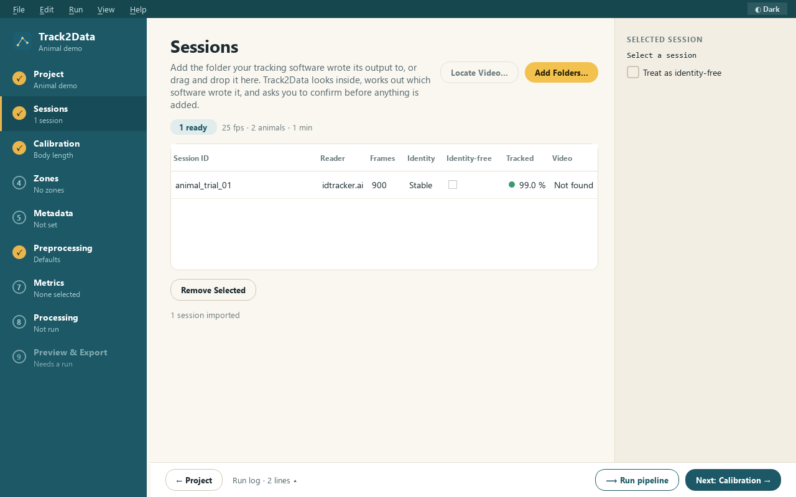

# 2 · Sessions

Add the idtracker.ai output folders you want to analyse (one folder per recorded video). Drag and
drop works too.

Each row shows what was read from the folder: reader, frame rate, number of frames, number of
animals, and **Identity** (`Stable` or `Unstable`).

**Identity-free**

Tick this if the video was tracked *without* identification, or if identities swapped so often that
"animal 1" is not one fish. Sessions flagged this way (by you or by idtracker.ai's own
`track_wo_identities`) skip every metric that follows an individual across frames, because those
numbers would be meaningless. Group metrics and the pooled zone-occupancy metrics still run. The
sidebar shows ⚠ while any session is identity-free.

**Good to know**

- Folders are only read, never modified.
- Adding the same folder twice is ignored.
- The status bar (bottom left) shows the session count.
- Supported: idtracker.ai 6.x output (the legacy v5 layout is also read). v4 is not supported yet (Track2Data tells you so if it recognises a v4 folder; see [sending a v4 sample](../IDTRACKERAI_V4_SAMPLES.md)).
