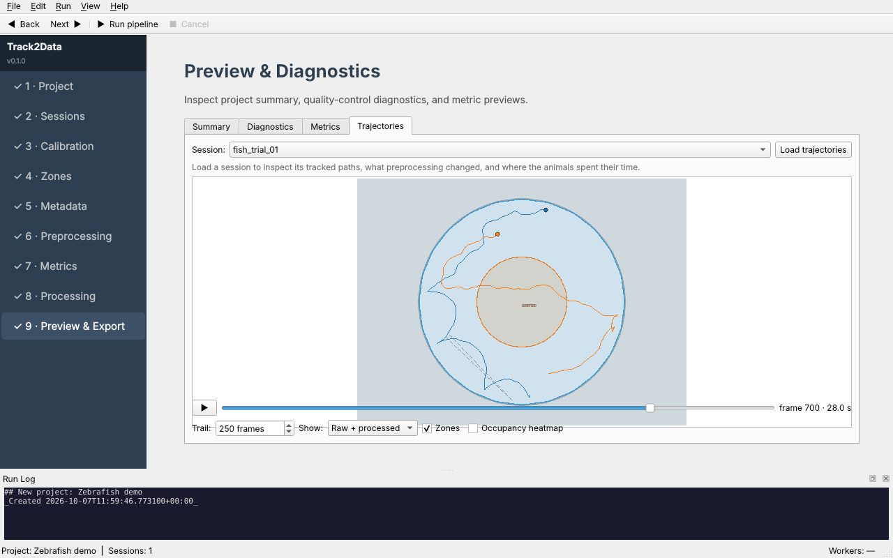
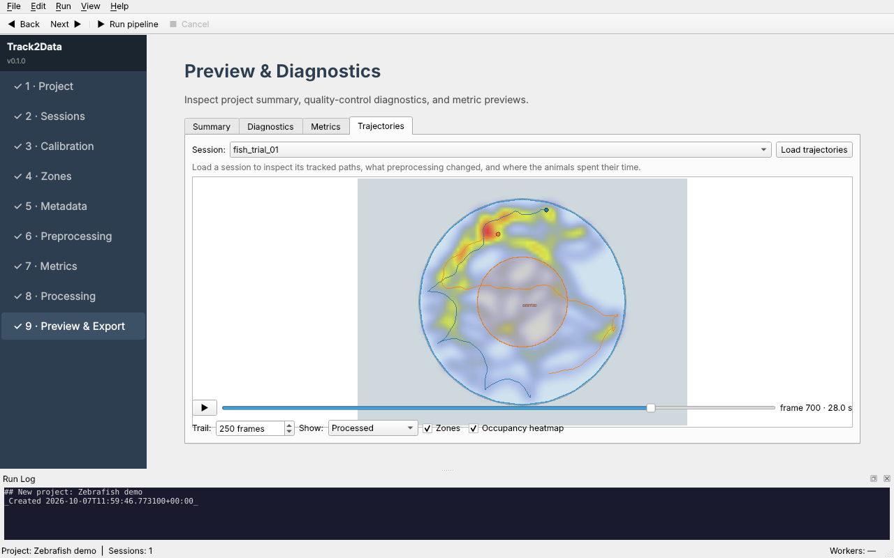
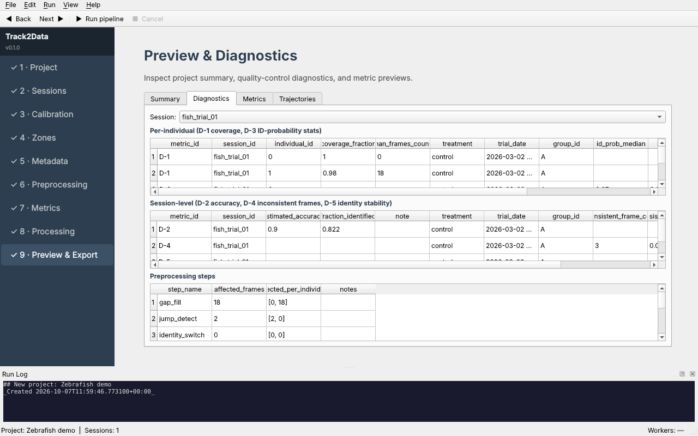

# 9 · Preview

Look before you export. Four tabs: **Summary**, **Diagnostics**, **Metrics**, **Trajectories**.

## Trajectories

Choose a session and **Load trajectories** (it reuses the cache after a run). Then:

- Drag the slider, or press ▶, to move through time. **Trail** sets how many past frames are drawn.
- **Show ▸ Raw + processed** draws the raw path as a dashed grey line next to the processed one, so
  you can see exactly what gap filling, jump removal and smoothing changed. In the screenshot the
  dashed line is a tracking jump that was removed.
- **Zones** shows or hides the saved zones. The mouse wheel zooms.

What to look for: a path that suddenly jumps across the arena (identity swap or detection error);
long straight lines where an animal was lost; smoothing that cuts corners of real turns.

## Occupancy heatmap

Tick **Occupancy heatmap** to see where the animals spent their time (red = most).

## Diagnostics

Per-animal tracking coverage and identification probability, session-level accuracy, inconsistent
frames and identity stability, plus the list of preprocessing steps and how many frames each one
changed.

## Metrics

A table preview of each selected metric for the chosen session.
