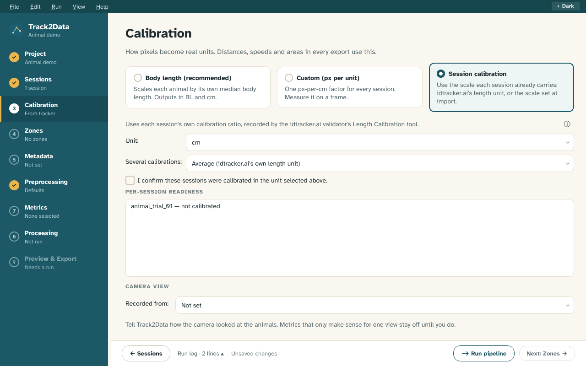

# Track2Data User Guide

**Turn idtracker.ai output into clean, calibrated, analysis-ready tables.**

© 2026 Martina Bellio. Track2Data is released under the [MIT licence](../../LICENSE).

---

## Contents

- [Introduction](#introduction): what Track2Data does, how to install it, the quick start
- [Part I: The workflow, screen by screen](#part-i-the-workflow-screen-by-screen)
  1. [Project](#1-project)
  2. [Sessions](#2-sessions)
  3. [Calibration](#3-calibration)
  4. [Zones (optional)](#4-zones-optional)
  5. [Metadata (optional)](#5-metadata-optional)
  6. [Preprocessing](#6-preprocessing)
  7. [Metrics](#7-metrics)
  8. [Processing](#8-processing)
  9. [Preview](#9-preview)
  10. [Export](#10-export)
- [Part II: Reference](#part-ii-reference)
  - [Understanding the output files](#understanding-the-output-files)
  - [Troubleshooting](#troubleshooting)

## Introduction

Track2Data turns [idtracker.ai](https://idtracker.ai) output folders into clean, calibrated,
analysis-ready tables. This guide follows the desktop app one screen at a time, using a small demo
project (two animals in a circular arena). Each screenshot sits next to the explanation of the screen
it shows.

> The screenshots are generated from the real app by
> [`scripts/generate_guide_screenshots.py`](../../scripts/generate_guide_screenshots.py), so they
> match the current version. In the app, **Help ▸ Open user guide** brings you here.

### Install and start

```bash
pip install "track2data[ui]"   # or, from a clone: pip install -e ".[ui]"
track2data-gui
```

Only need the command line? `pip install track2data` gives you `track2data run project.t2d.json`
(see [`track2data --help`](../../README.md#installation)).

### How the workflow is organised

The left sidebar lists the stages. A badge shows where each one stands:

| Badge | Meaning |
|---|---|
| ✓ | complete |
| ⚠ | usable, but look at the tooltip (e.g. a session has no stable identities) |
| ✗ | must be fixed before you can continue |
| ○ | nothing entered yet (optional stages stay ○) |

**Settings save themselves.** There are no Apply buttons: a change is stored a moment after you
make it, and again when you leave the screen. **Next** (bottom right) stays disabled, with a tooltip saying why,
until Project, Sessions and Metrics are filled in and the calibration is valid.

| # | Screen | What you do |
|---|---|---|
| 1 | [Project](#1-project) | Create or open a project |
| 2 | [Sessions](#2-sessions) | Add idtracker.ai output folders |
| 3 | [Calibration](#3-calibration) | Choose how pixels become body lengths or cm |
| 4 | [Zones](#4-zones-optional) | Draw regions of interest (optional) |
| 5 | [Metadata](#5-metadata-optional) | Attach treatment, date, … from a CSV (optional) |
| 6 | [Preprocessing](#6-preprocessing) | Gap filling, jump removal, smoothing |
| 7 | [Metrics](#7-metrics) | Pick what to compute |
| 8 | [Processing](#8-processing) | Run the pipeline |
| 9 | [Preview](#9-preview) | Check trajectories, diagnostics and metric tables |
| 10 | [Export](#10-export) | Write CSV / Feather / Excel and load them in R or Python |

### Quick start (five minutes)

1. **File ▸ New project…**, name it. You land on *Sessions*.
2. **Add Folders…** and choose one or more idtracker.ai session folders.
3. Leave *Calibration* on **Body length** unless you know your pixels-per-cm.
4. On *Metrics*, pick a preset such as **Standard locomotor**.
5. **▶ Run pipeline**, then look at **Preview ▸ Trajectories** to confirm tracking looks right.
6. On *Export*, tick the formats you want and **Export**.

Do step 5 before trusting any number: the trajectory view is the quickest way to spot identity
swaps, tracking gaps and over-aggressive smoothing.

# Part I: The workflow, screen by screen

## 1. Project

A project is one `.t2d.json` file next to a folder of results. It stores every setting on the
following screens, so you can close the app and pick up later, or re-run the identical analysis
from the command line.

<figure>

<figcaption><b>Figure 1.</b> The Project screen, where every analysis starts.</figcaption>
</figure>

**Do this**

1. **File ▸ New project…**, enter a name, choose a folder. Or **File ▸ Open project…** for an
   existing `.t2d.json`.
2. Track2Data moves straight on to [Sessions](#2-sessions).

**Notes**

- **Changes are saved automatically** about half a second after you stop editing. The footer says
  **Unsaved changes** while one is pending and **Saved** once the file is on disk; if writing fails
  it says **Not saved** (hover for the reason) and your edits stay open. **File ▸ Save project**
  saves at once, including any value you have typed but not yet confirmed. The file is replaced
  atomically, so a failed save never leaves a half-written project.
- Closing the window, **New project** and **Open project** save first, and do nothing if saving
  fails. A reopened project saves back to the file it came from, and **New project** will not
  overwrite an existing project of the same name.
- Reopening a project re-reads each session folder in the background, so frame counts and
  calibration readiness appear again after a moment.
- Preprocessed sessions are cached in `.t2d_cache/` inside the project folder. It is safe to delete
  (`track2data cache clear --cache-dir <dir>` does it too); it is rebuilt when needed.
- **2D or 3D.** The **Analysis type** choice sets whether the project is a 2-D analysis (the default) or
  a 3-D one. 3D also asks how the recording was made: **One video, two panels** (top and side views in
  one frame) or **Two videos** (top and side tracked separately). The choice locks after the first
  session is added; remove all sessions to change it. A 3-D project can be set up and saved, but it
  cannot be run yet: Processing, Preview and Export say "3-D fusion is not available yet", and
  Calibration, Zones and Metrics apply to the 2-D tracks only.

## 2. Sessions

Add the folders your tracking software wrote its output to, one per recorded video. Adding is two
steps: Track2Data looks inside what you picked, then asks you to confirm before anything joins the
project.

<figure>

<figcaption><b>Figure 2.</b> The Sessions screen lists every session with what was read from it.</figcaption>
</figure>

### Add sessions: scan, confirm, add

1. Press **Add Folders…**, or drag folders (or single tracking files) onto the screen. A progress
   bar with **Cancel** shows while Track2Data looks inside. Picking something else meanwhile
   replaces the scan.
2. When the scan ends, **Confirm tracking software** opens (Figure 3). It says which software
   wrote the folder, how sure it is (*High*, *Medium* or *Low confidence*) and why. If it chose
   wrongly, change **Software**.
3. Fill in any options the files do not record (a frame rate, a frame size, which keypoint stands
   for the animal). A required option shows *required* until you set it; Track2Data never guesses
   one, because a made-up frame rate would corrupt every speed.
4. Untick sessions you do not want, or rename them in the *Session* column. **Add** (it shows how
   many) stays disabled until adding would work, and its tooltip says what is missing.

<figure>

<figcaption><b>Figure 3.</b> The confirm step: the software found, why, and the sessions about to be added.</figcaption>
</figure>

A scan that finds nothing still opens the dialog and lists what it saw and what this version can
read. A scan that fails writes its reason under the buttons. The chosen software is saved with each
session, so reopening the project reads it the same way again.

Each row of the table shows what was read: the software (*Reader*), frame rate, number of frames,
number of animals, **Identity** (`Stable` or `Unstable`) and **Video**.

### Video: Found, Not found, Located

idtracker.ai records the path the video had on the computer it was tracked on, which is often not
valid on yours. **Found** means the file is there. **Not found** means it is not; metrics are
unaffected, but the video preview is unavailable. Select the row and press **Locate Video…** to
point at the file; the row then reads **Located**, and the choice is stored in the project.

**Identity-free**

Tick this if the video was tracked *without* identification, or if identities swapped so often that
"animal 1" is not one animal. Sessions flagged this way (by you or by idtracker.ai's own
`track_wo_identities`) skip every metric that follows an individual across frames, because those
numbers would be meaningless. Group metrics and the pooled zone-occupancy metrics still run. The
sidebar shows ⚠ while any session is identity-free.

**Good to know**

- Folders are only read, never modified.
- Adding the same folder twice is ignored.
- The sidebar shows the session count under **Sessions**, and the chips above the table split them into ready and identity-free.
- Supported: idtracker.ai 6.x output (the legacy v5 layout is also read). v4 is not supported yet (Track2Data tells you so if it recognises a v4 folder; see
  [sending a v4 sample](../IDTRACKERAI_V4_SAMPLES.md)).

### Views (3-D projects)

In a 3-D project (set on the Project screen) every fish is tracked in two views, so Track2Data has
to know which session is the top view, which is the side view, and which top session goes with
which side session. This is the **Views** page. It appears only in 3-D projects, under the
**Sessions** row of the sidebar, and **Next** and **Back** pass through it between Sessions and
Calibration. In 2-D projects it does not exist.

- **Roles.** Each session has a **View** selector: *(not set)*, *Top* or *Side*.
- **Pair by session name.** Two pattern fields, **Top sessions** and **Side sessions**, find the
  pairs from the session names. A pattern is a regular expression, searched anywhere in the session
  id, with a group called `key` that marks the part shared by both views. Sessions whose `key` is
  equal become a pair. Example: `(?P<key>.+)_top$` matches `trial01_top` with key `trial01`, and
  `(?P<key>.+)_side$` matches `trial01_side` with the same key, so the two are paired. The **ⓘ**
  button next to each field explains this in the app. A line under the fields says how many
  sessions each pattern catches and lists unpaired or ambiguous ones (several sessions with the
  same key are not paired) and sessions that match **both** patterns ("Match both patterns"; these
  are not paired). An empty `key` means no match. Press **Pair by pattern** to set the roles and
  create the pairs. Pressing it again keeps the pairs it made earlier that the patterns still
  produce, with their matching, and removes the ones they no longer produce. Sessions in pairs you
  made or changed by hand are skipped: the button never touches those pairs.
- **Pairs.** One row per pair, with a **Same IDs** tick, a **Status** and **Remove**. To pair by
  hand, choose a top and a side session below the list (only sessions with that role and not yet in
  a pair are offered) and press **Add pair**. A session belongs to at most one pair.
- **Same IDs.** Tick it when fish with the same label are the same fish in both views; the fish map
  is then filled in for the labels present in **both** views (the others stay unmatched), and filled
  in again if the labels of either session change. The tick is disabled while either session has no
  stable identities or its fish labels are not known yet (hover over it to see which). Unticking
  clears only the tick and keeps the map. Changing a fish in the matching table clears the tick and
  makes the pair yours, so **Pair by pattern** no longer touches it; ticking or unticking does too.
- **Match fish.** Select a pair to get a table with one row per top-view fish and a dropdown for the
  side-view fish (or *(no match)*; a side fish already used is marked). Selecting a row highlights
  that fish and its match in the two track plots beside the table.
- **Status.** The fish map is checked first. If the checks find a problem, the status shows it and
  the tooltip lists all of them, for example "cannot match fish: this session has no stable
  identities" (identity-free sessions cannot be matched), "duplicate side fish: ...", "unknown top
  fish: ..." or "3 top fish vs 2 side fish" (an unequal count is shown even before any fish is
  matched). Only when nothing is wrong does the status read *Needs matching* (no fish matched yet)
  or *Matched* (at least one fish matched; the tooltip lists fish still unmatched).
- **Sidebar.** In a 3-D project the **Sessions** row of the sidebar shows the worse of the Sessions
  and Views statuses, and its tooltip adds the Views message (for example "Views: Session t1_top
  is not paired."). Its summary line counts sessions and pairs. The row keeps its number, without
  the ✓, until every session has a view; it gets the ✓ once every session has one, and the
  tooltip still lists what is left (an unpaired session, a pair to match, a session without stable
  identities). The sidebar checks the saved roles and pairs only; the page checks the fish maps
  against the fish labels. None of this stops you from continuing.

This only records the correspondence. 3-D fusion and 3-D metrics do not exist yet, so a 3-D project
still cannot be run: Processing, Preview and Export stay blocked.

### Panels (one video, two views)

If you chose the layout **One video, two panels** on the Project screen, the top and side views are
two parts (panels) of one video. The **Views** page then has a **Panels** section with one row per
session, showing its panel (*whole video* or the rectangle as x, y, width × height in pixels). Select a
row to use the buttons.

- **Split into panels…** is for one tracker run on the whole frame. The editor offers the presets
  **Left | Right** and **Top | Bottom** with a split slider (50% by default), exact x, y, width and
  height fields for each panel, and a choice of which panel is the top view. A preview shows the
  tracker's background image, or else the first video frame, or else the tracks, with the two
  rectangles over it. A table lists each fish with its panel, the share of its positions inside
  (*Inside*) and a *Flag*: *low* under 90%, *left out* under 50% (such a fish is not in that panel's
  session), *no data* when it has no position. **OK** is off while a rectangle is invalid or a panel
  would have no fish. The session is replaced by two, `<id>__top` and `<id>__side` (a number is added
  if the name is taken), each with its panel, the view set, and a hand-made pair.
- **Set panel…** is for two tracker runs on the same video, each limited to one panel: it opens the
  same editor with one rectangle for the selected session.
- **Clear panel** puts the session back on the whole video.

A session with a panel keeps the fish with at least 50% of their positions inside it, and positions
outside become empty (NaN) because they belong to the other view. Coordinates are relative to the
panel (its top-left corner is 0, 0) and the video size becomes the panel size, so the Zones,
Calibration and Preview screens show only the panel. The same folder with a different panel counts
as a different session. Changing or clearing a panel resets the fish matching of its pair (the pair
stays).

Zones are still one set per project, and per-view pixel scale calibration is not part of this
version. 3-D projects still cannot be run.

## 3. Calibration

Calibration decides which units distances and speeds are reported in. Figure 4 shows the default,
**Body length** mode.

<figure>

<figcaption><b>Figure 4.</b> Calibration in Body length mode, with a summary of the body lengths read from your sessions.</figcaption>
</figure>

| Mode | Use it when | Reports |
|---|---|---|
| **Body length** (recommended) | You do not have a reliable scale | `*_bl` columns: distances in body lengths. Physical `*_cm` columns stay empty. |
| **Custom (px per unit)** | You know the scale | `*_cm` columns, and `*_bl` columns too whenever the tracker recorded body length |
| **Session calibration** | Each session already carries a scale: idtracker.ai's *Length Calibration* tool, a Ctrax / JAABA `trx.mat` `pxpermm`, or a scale you gave when importing | each session's own ratio; you must confirm the unit |

In Session calibration mode, Track2Data also records how much your length-calibration clicks disagreed
(a relative spread, saved in `sessions.csv` as `length_calibration_rel_sd`) and warns when it is above 5%.
A warning means the scale is less certain, and so are the `*_cm` values.

In Body length mode the screen summarises the body lengths read from your sessions (median and
range, in pixels) so you can sanity-check them.

### Custom scale: measure on the frame

Pick **Custom**, then **Measure on frame…**. Click both ends of something of known length (a ruler,
the arena diameter), type its real length, and press OK. The pixels-per-unit value is filled in for
you. A third click starts the measurement over.

<figure>

<figcaption><b>Figure 5.</b> Custom calibration: click both ends of an object of known length to fill in the scale.</figcaption>
</figure>

If a mode is incomplete (no scale, or an unconfirmed unit) the stage shows ✗ and **Next** is
disabled until you fix it.

### Session calibration: where each tracker's scale comes from

Only some trackers record a scale. The **ⓘ** button beside the description opens a short note on
what each tracker in your project records, with links to its documentation. Figure 6 shows the mode.

<figure>

<figcaption><b>Figure 6.</b> Session calibration: the unit, the choice between several calibrations, the confirmation and each session's readiness.</figcaption>
</figure>

| Tracker | Where the scale comes from |
|---|---|
| **idtracker.ai** | The Validator's *Length Calibration* tool saves one or more measurements. `length_unit` is their average: a factor from pixels to *user-defined units*. idtracker.ai does not record whether you measured in cm or mm, so the **Unit** you pick is your own declaration and you must confirm it. See the [idtrackerai.Session reference](https://idtracker.ai/latest/reference/generated/idtrackerai.Session.html). |
| **Ctrax / JAABA `trx.mat`** | `pxpermm` (pixels per millimetre), present once the file's units were converted. Track2Data turns it into pixels per cm and ignores a value of exactly 1, which those tools use for "never calibrated". See [the Ctrax trx fields](https://ctrax.sourceforge.net/bmat.html). |
| **DeepLabCut, SLEAP, Ctrax raw `.mat`** | Their files record no scale. Give **Scale (pixels per cm)** in the confirm step when you add the sessions, or use **Custom** or **Body length**. |

The per-session readiness list says whether each session is calibrated and with which value. A
session without a scale reads *not calibrated* (idtracker.ai) or *no scale set at import* (other
trackers). The **Session calibration** card is disabled when no session in the project can supply a
scale.

**Several calibrations.** An idtracker.ai session can hold several length measurements. With
**Several calibrations** you choose **Average** (idtracker.ai's own `length_unit`, the default) or
**Median** (one badly placed click cannot move it). The list shows which one is in use, for example
*median of 3*. If the saved `length_unit` differs from the average of the session's measurements
(they were edited after export), the saved value is used and the run log carries a warning.

### Camera view

Further down the same screen, **Camera view** says how the camera looked at the animals: **Not
set** (the default), **Top-down**, or **Side view**. It is saved with the project, separately from
the calibration, and a project that never sets it behaves exactly as before.

Some metrics only make sense for one view. Today that is **Vertical Position (Depth)**, IL-15,
which needs a side view: on a top-down recording the image's vertical axis is not depth. Until you
declare a side view, that row is greyed on the Metrics screen and its tooltip says how to switch
it on; if it is selected anyway, the run skips it and the run's README says so. Declaring a view
does not switch off any existing metric. Thigmotaxis (IL-14) and distance from the centre (IL-3)
still assume you are looking down on the arena, so read them accordingly on a side view.

For depth, draw a **main** zone from the waterline to the floor on the Zones screen. The top edge
is the surface and the bottom edge the floor; Track2Data never substitutes the video frame, so with
no main zone the depth columns are empty and say why. For time in the upper or lower part of the
tank, draw stacked secondary zones and use the zone metrics (Z-1 to Z-9).

## 4. Zones (optional)

Zones are regions of interest (the whole arena, a centre area, a feeder). Zone metrics need at least
one. You can:

- **Import ROIs from Session**: use the polygons drawn in idtracker.ai's validator.
- **Load zones from CSV…**.
- Draw your own, as described below.

<figure>

<figcaption><b>Figure 7.</b> The zone list, with the import and load buttons.</figcaption>
</figure>

### Drawing zones

Scroll down to the canvas, which shows the session's background image. Saved zones appear shaded
with their names.

<figure>

<figcaption><b>Figure 8.</b> The zone canvas: saved zones are shaded and named, validator landmarks are blue.</figcaption>
</figure>

| Tool | How |
|---|---|
| **Points** | Click validator landmarks (blue) in order. **Add Custom Point** lets you click anywhere. |
| **Rectangle** | Drag from one corner to the opposite corner |
| **Circle** | Drag from the centre outwards |
| **Undo point** / Ctrl+Z | Remove the last vertex |
| **Fit** | Fit the whole image in view. The mouse wheel zooms; hold the middle button and drag to pan. |

Custom vertices (orange/green) can be dragged to fine-tune the outline. When the shape looks right
(at least 3 points), give it a **name** and a **level** (`main` or `secondary`) and press
**Save Zone**.

To reshape a saved zone, select it in the list and drag its vertices. A move that would leave the
zone with no area (all vertices in a line), repeat a point, or make its edges cross is refused: a
message says why, the handle jumps back and the zone stays as it was.

If a zone's source resolution differs from a session's video, a yellow warning appears.

## 5. Metadata (optional)

Attach experimental information (treatment, date, tank, …) to every row of the output.

<figure>

<figcaption><b>Figure 9.</b> The Metadata screen: CSV preview, column mapping and the match summary.</figcaption>
</figure>

1. **Load metadata CSV…**. The first rows are previewed.
2. Match columns to fields. Names like `date`, `condition` or `tank` are matched automatically to
   *Trial date*, *Treatment*, *Group ID*; change any you disagree with, or leave a field on
   `(skip)`.
3. The line under the mapping tells you how many sessions found a row (`1 of 1 sessions matched`)
   and names any that did not.

The `session_id` column must equal the session folder name. Without an *Individual ID* column one
row is matched per session (if several rows match, the first is used and the summary says so).

### Per-animal information (sex, weight, genotype of individual animals)

Give the CSV **one row per animal** and map its animal column (`fish_id`, `animal_id` or any name)
to *Individual ID*. Then:

- **Match animals by** decides how each value is matched to an animal. *Validator label* uses the
  names set in the idtracker.ai Validator (the default labels are `1`, `2`, …) and falls back to the
  0-based position for a session that has none. *Position* always uses the 0-based position (the
  `individual_id` of the exported tables).
- Tick the other columns you want under **Also include these columns**. Columns that are not mapped
  to a field and not ticked are dropped.
- Per-animal values land on every row that has an `individual_id` (the per-frame table and the
  individual metric tables). Values that are the same for all animals of a session (such as
  `treatment`) also go onto the group tables; per-animal values never do.
- The summary lists animals with no row (their cells stay empty), and CSV rows whose animal matches
  nothing.
- **Identity-free sessions** get no per-animal values: their rows are detection slots, not animals.
  Session-level fields still apply.

Pick the right match mode: if your CSV counts animals from 1 and the Validator labels are the default
`1`, `2`, … use *Validator label*; if it counts from 0, use *Position*. A column named like an
engine column (`speed_px_s`, `frame`, `bin_index`, …) is never carried, so it cannot overwrite data.

**Skip metadata** removes the file if you change your mind.

## 6. Preprocessing

Cleaning applied to the trajectories before any metric is computed. Defaults suit most data. Every
step has an **Enabled** box; the raw data is never overwritten.

<figure>

<figcaption><b>Figure 10.</b> The Preprocessing screen with the default settings.</figcaption>
</figure>

| Step | What it does |
|---|---|
| **Gap fill** | Linearly interpolates tracking gaps up to *Max gap frames* (gaps between tracking intervals have their own option, below) |
| **Jump detection** | Finds implausible position jumps (standard-deviation multiple, percentile, or idtracker.ai's own velocity threshold) and replaces them |
| **Identity switch correction** | See below. Off by default |
| **Smoothing** | Moving average or Savitzky–Golay, over *Window* frames |
| **Coverage gate** | Warns when more than *Max NaN fraction* of an animal's frames are missing |

### Sessions tracked in separate intervals

idtracker.ai can track only some stretches of a video. Its trajectory file then holds just those
frames, and Track2Data puts them back on the real timeline: speeds, smoothing and zone times are
computed over the true elapsed time, and the stretches in between are **never read as adjacent
frames** (that used to turn a move across a 40-second gap into one frame of motion).

By default the untracked stretch stays empty: nothing is interpolated, distance is not counted across
it and a stay in a zone is cut there. Tick **Interpolate across gaps between tracking intervals** to
fill gaps of up to *Longest interval gap to fill* seconds (30 s by default) with a straight line
between each animal's last and next observed position. This is an assumption about where the animal
went, not a measurement:

- Filled frames appear in the per-frame table with `was_interpolated` true and `in_tracking_interval`
  false, and are counted by the *Interpolated* column of the quality grid (diagnostic D-11).
- Distance, speed, activity and zone time include them; zone events on them carry `estimated`.
- It needs stable identities and an observed position for that animal on both sides, and never
  extrapolates. Sessions marked identity-free are never bridged.
- A gap longer than the limit stays a break. The limit exists so one long gap cannot quietly be
  replaced by a made-up path.

<figure>

<figcaption><b>Figure 11.</b> The identity switch correction options (experimental, off by default).</figcaption>
</figure>

**Identity switch correction is experimental and off by default.** It reassigns identities from
geometry alone, ignoring idtracker.ai's own fragment boundaries. On a real recording it re-permuted a
large share of frames and inflated path length enormously. Leave it off unless you have checked the
result in [Preview ▸ Trajectories](#trajectories) with *Raw + processed* shown.

Settings you change here are saved automatically and used for the next run.

## 7. Metrics

Choose what to compute. Metrics are grouped on three tabs: **Individual** (per animal), **Group**
(across animals) and **Zone** (needs zones; the tab is disabled without them).

<figure>

<figcaption><b>Figure 12.</b> The Metrics screen, with search, presets and the three metric tabs.</figcaption>
</figure>

- **Search** filters all tabs by name or ID (`speed`, `IL-2`). The line beneath says which tabs
  match.
- **Presets** replace the current selection: *Standard locomotor*, *Thigmotaxis & space use*,
  *Social dynamics*, *All metrics*.
- **ⓘ** opens the definition, formula and literature reference of a metric; **⚙** edits its
  parameters (available on metrics that have any).
- The counter shows how many are selected.
- **Quality threshold** drops frames whose identification probability is below the value.
- **Time bins** splits every session into bins of the chosen length (minutes) and reports each
  metric per bin, with `bin_index`, `bin_start_s` and `bin_end_s` columns. *Whole session* (the
  default) turns it off. Whole-track metrics (tortuosity, home-base stability) stay one row per
  animal with empty bin columns; diagnostics are always whole-session. Thresholds such as the
  freezing speed threshold are fixed from the whole session, so bins are comparable.
- Rows are greyed out for sessions without stable identities; see
  [Sessions](#2-sessions).

**Diagnostics** (coverage, tracking accuracy, identity stability, …) are always computed and are not
listed here; they appear in [Preview ▸ Diagnostics](#diagnostics).

Every metric is documented in [`docs/METRICS_SPEC.md`](../METRICS_SPEC.md).

## 8. Processing

**Validate pipeline** checks the project and lists anything that would stop a run. **Run pipeline**
(or the button in the footer bar, or Ctrl+R) processes every session: import, preprocessing, calibration,
zone assignment, metrics, export.

<figure>

<figcaption><b>Figure 13.</b> The Processing screen: one row per session, with status and duration.</figcaption>
</figure>

- The table shows each session's status and duration. A failed session is marked *Failed* and does
  not stop the others.
- **Workers** sets how many sessions run at the same time. `1` runs them one after another. More
  workers help when each session takes many seconds or more; for short sessions the start-up cost
  of each worker makes it slower.
- **Cancel** stops the run at the next safe point (between sessions, preprocessing steps or
  metrics).
- Preprocessed sessions are cached, so re-running after changing only metrics or export settings
  skips the slow parts.

Results are written to `<project>/exports/<timestamp>/<session>/`.

## 9. Preview

Look before you export. Four tabs: **Summary**, **Diagnostics**, **Metrics**, **Trajectories**.

**Are these results current?** If you change a setting that affects the numbers (sessions,
calibration, zones, metadata, preprocessing, metrics) after a run, a warning appears at the top of
Preview and the sidebar says *Settings changed · re-run*: what you are looking at came from the
older settings. Changing only where or in which format to export does not do this, and putting a
setting back clears the warning. A run that finishes after you edited is judged against the settings
it started with, so it cannot make newer edits look current, and a run that finishes for a project you
have since replaced is discarded. A run in which no session succeeded is shown as *No successful
sessions*, not as ready. Export recomputes the metrics under the current settings either way.

### Trajectories

Choose a session and **Load trajectories** (it reuses the cache after a run). Then:

<figure>

<figcaption><b>Figure 14.</b> Trajectories with Raw + processed shown: the dashed grey line is a tracking jump that was removed.</figcaption>
</figure>

- Drag the slider, or press ▶, to move through time. **Trail** sets how many past frames are drawn.
- **Show ▸ Raw + processed** draws the raw path as a dashed grey line next to the processed one, so
  you can see exactly what gap filling, jump removal and smoothing changed. In Figure 14 the
  dashed line is a tracking jump that was removed.
- **Zones** shows or hides the saved zones. The mouse wheel zooms.

What to look for: a path that suddenly jumps across the arena (identity swap or detection error);
long straight lines where an animal was lost; smoothing that cuts corners of real turns.

### Occupancy heatmap

Tick **Occupancy heatmap** to see where the animals spent their time (red = most).

<figure>

<figcaption><b>Figure 15.</b> The occupancy heatmap.</figcaption>
</figure>

### Diagnostics

Per-animal tracking coverage and identification probability, session-level accuracy, inconsistent
frames and identity stability, plus the list of preprocessing steps and how many frames each one
changed.

<figure>

<figcaption><b>Figure 16.</b> The Diagnostics tab.</figcaption>
</figure>

### Metrics

A table preview of each selected metric for the chosen session.

## 10. Export

Tick the formats you want, choose where to write them, and press **Export**.

<figure>

<figcaption><b>Figure 17.</b> The Export screen, with the file receipt after an export.</figcaption>
</figure>

1. Tick the formats you want.

   | Format | Files |
   |---|---|
   | CSV Long | `master_fish_by_frame.csv`, `trial_activity_summary.csv`, `group_dynamics_summary.csv` |
   | CSV Wide | `trial_summary_wide.csv` |
   | Excel | `Track2Data_<project>.xlsx` (one sheet per table) |
   | Feather | `master_fish_by_frame.feather`, `trial_activity_summary.feather` |
   | README | provenance record (always written alongside the others) |

2. **Browse output directory…** or keep the default.
3. **Export**. Metrics and files are produced again under the current settings, but preprocessing comes from the cache when
   nothing relevant changed.

The **receipt** lists every file with its size and SHA-256. **Copy CLI equivalent** gives the
`track2data run …` command that reproduces this export.

> Very long recordings: Excel limits a sheet to about one million rows, so the per-frame table
> continues on *Fish by Frame 2*, … The CSV and Feather files always hold the whole table.

### Load the data in R or Python

After an export, the panel at the bottom gives ready-to-paste code for the files just written
(R/tidyverse or Python/pandas). **Copy code**, paste, run.

<figure>

<figcaption><b>Figure 18.</b> Ready-to-paste R and Python snippets for the files just written.</figcaption>
</figure>

See [Understanding the output files](#understanding-the-output-files) for what the columns mean.

# Part II: Reference

## Understanding the output files

Each session is written to `<out_dir>/<session_id>/`. Files differ by exporter; the tables are the
same.

When the export holds two or more sessions, an extra folder `<out_dir>/all_sessions/` stacks the sessions
together: its `master_fish_by_frame.csv`, `trial_activity_summary.csv`, `group_dynamics_summary.csv` and
`metrics_long.csv` are the per-session files of the same name joined one after another, with `session_id`
saying which session each row came from. Nothing is recomputed. A column that one session lacks (for example
because its metric selection differed) is left blank for that session's rows. It also gets a `manifest.json`
and `README.md` listing the sessions and their input checksums. Stacking is not the same as pooling: check
`PROJECT_SUMMARY.md` and `sessions.csv` for differences in frame rate, group size or calibration first, and
treat `session_id` as a grouping factor in your model. A single-session export has no `all_sessions/` folder. Use either the session folders or `all_sessions/`,
not both: loading both counts every row twice.

| Table | One row per | Contents |
|---|---|---|
| `master_fish_by_frame` | session × animal × frame | `time_s`, `x_px`, `y_px`, `was_interpolated` (true where preprocessing filled a gap), `speed_px_s`, `heading_rad`, `main_zone`, `sec_zone`, plus calibrated and metadata columns |
| `trial_activity_summary` | session × animal | individual-level metrics, plus metadata |
| `group_dynamics_summary` | session | group-level metrics, plus metadata |
| `trial_summary_wide` | session × animal | all summary metrics side by side |

- **Time bins** (when set on the Metrics screen): summary tables have one row per animal *per bin*, with `bin_index`, `bin_start_s`, `bin_end_s`; `master_fish_by_frame` gets `bin_index`. Metrics that are not meaningful per window keep a single row with empty bin columns.

### Column naming

| Suffix | Meaning |
|---|---|
| `_px` | pixels |
| `_cm` | centimetres (only with a scale; otherwise empty) |
| `_bl` | body lengths (needs the tracker's body length; independent of the calibration mode and of any physical scale) |
| `_s` | per second |

### Things to know

- **Empty `*_cm` columns** mean no pixels-per-unit scale was set, not an error. Use `*_bl`, or set a
  scale on the [Calibration](#3-calibration) screen.
- **Identity-free sessions** have no per-animal rows for metrics that follow an individual; zone
  occupancy (Z-1, Z-2, Z-8) is reported pooled over animals, without an `individual_id` column.
- **Missing positions** are empty values, never zeros.
- The README written next to the files records the settings and versions used, and the SHA-256 of
  each output, so a result can be traced and reproduced.

Definitions, formulas and references for every metric: [`docs/METRICS_SPEC.md`](../METRICS_SPEC.md).

## Troubleshooting

| You see | Why | What to do |
|---|---|---|
| **Next** is disabled | A required stage is empty or invalid | Hover over Next: the tooltip names the problem. Check the ✗ / ○ badges in the sidebar |
| *"Session calibration selected but these sessions have no length_unit"* | A session has no scale (idtracker.ai never calibrated it, or the other tracker's file records none) | Calibrate it in the idtracker.ai Validator, give **Scale (pixels per cm)** when importing, or switch the calibration mode |
| *"No reader recognised the session folder"* | The folder is not an idtracker.ai output | Pick the session folder itself (the one containing `trajectories/`). Supported: idtracker.ai 6.x output (the legacy v5 layout also works); v4 is not supported yet (a v4-looking folder gets a specific message; see [sending a v4 sample](../IDTRACKERAI_V4_SAMPLES.md)) |
| Video column says *Not found* | The video path idtracker.ai recorded does not exist on this computer | Select the session and press **Locate Video…** (Sessions). Metrics do not need the video |
| *READER_NOT_AVAILABLE* | A project session was added with software this version of Track2Data does not have | Install a version that has that reader. Track2Data will not read it with a different one, since that could change the numbers |
| *READER_OPTION_MISSING* | The software does not record an option (such as frame rate) and none was entered | Add the folder again and fill in the *required* option in the confirm dialog |
| Session frames / animals show `—` | The folder is still being read | Wait a moment; a failed read is reported in the Run Log |
| `*_cm` columns are empty | No pixels-per-unit scale | Use `*_bl` columns or set a scale in [Calibration](#3-calibration) |
| ⚠ on *Sessions* | A session is identity-free | Expected for sessions tracked without identities; see [Sessions](#2-sessions) |
| Individual metrics missing for a session | That session is identity-free | Untick *Identity-free* only if identities really are stable |
| *"N of M sessions matched"* with names listed | Those `session_id` values are not in the metadata CSV | Fix the CSV or the session folder names |
| A zone warning about resolution | Zones were drawn on a different image size | Redraw them on this session, or confirm the sizes really match |
| Path length looks far too large | Jumps or identity swaps | Open [Preview ▸ Trajectories](#trajectories) with *Raw + processed*; keep *Identity switch correction* off |
| Excel file has *Fish by Frame 2* | The table exceeded Excel's row limit | Use the CSV or Feather file for the complete table |
| Parallel run slower than sequential | Short sessions; each worker takes time to start | Use 1 worker |
| macOS says the app is damaged / Windows SmartScreen blocks it | Releases are not signed yet | See [`docs/CODE_SIGNING.md`](../CODE_SIGNING.md) |

Still stuck? Open the **Run Log** (View ▸ Toggle Run Log), then an issue on GitHub with its text.

---

© 2026 Martina Bellio. Released under the MIT licence.
